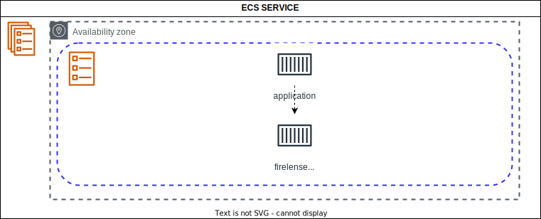
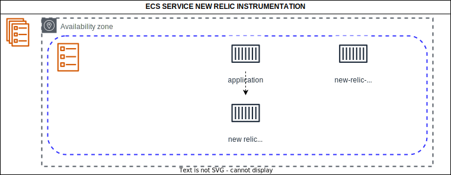
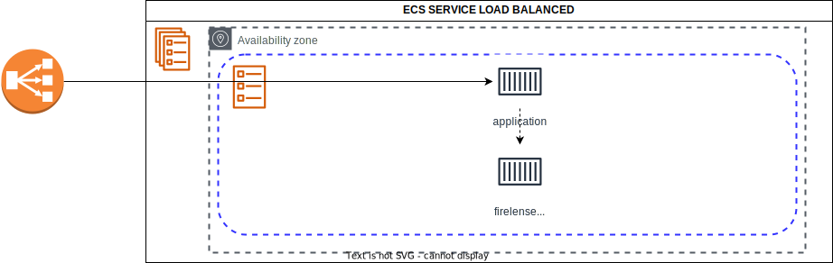
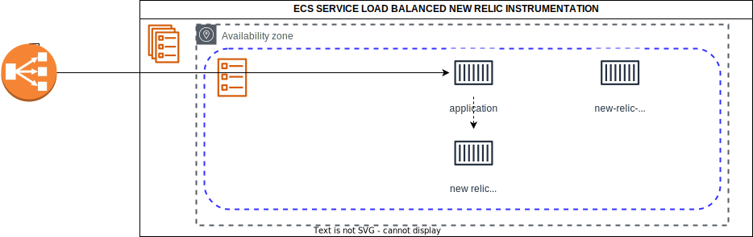
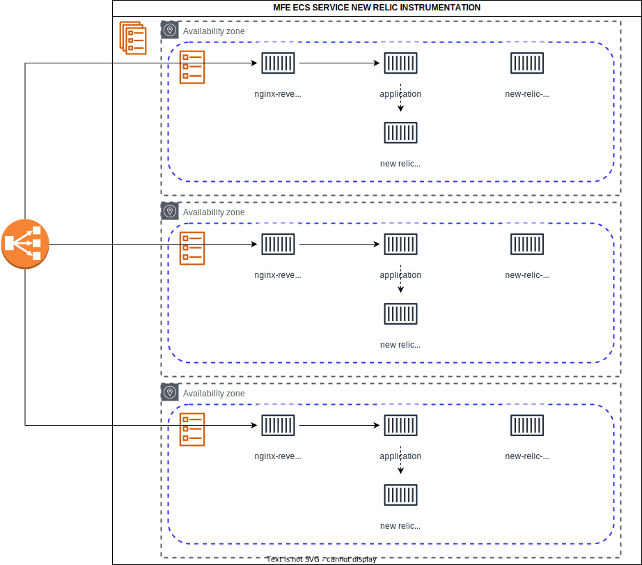

# terraform-aws-ecs-fargate

TODO:

- NONE

KNOWN ISSUES:

[ ] ECS Task role error on service first create. (ECS Service will launch moments later when IAM role is available)

[ ] Target group in use issue when changing parameters. (Re run tf apply)

[ ] After applying target tracking scaling a deployment is required to enable it. (This must be triggered manually or by a push to ecr.)

#### ECS Service

#### ECS Service with New Relic Instrumentation

#### ECS Service Load Balanced

#### ECS Service Load Balanced with New Relic Instrumentation

#### ECS MFE Deployment with New Relic Instrumentation

#### Fargate CPU and Memory Configuration Table

| Memory value (MiB)                                                                                   | CPU value      | Operating systems supported for Fargate |
|------------------------------------------------------------------------------------------------------|----------------|-----------------------------------------|
| 512 (0.5 GB), 1024 (1 GB), 2048 (2 GB)                                                               | 256 (.25 vCPU) | Linux                                   |
| 1024 (1 GB), 2048 (2 GB), 3072 (3 GB), 4096 (4 GB)                                                   | 512 (.5 vCPU)  | Linux                                   |
| 2048 (2 GB), 3072 (3 GB), 4096 (4GB), 5120 (5 GB), 6144 (6 GB), 7168 (7 GB), 8192 (8 GB)             | 1024 (1 vCPU)  | Linux, Windows                          |
| Between 4096 (4 GB) and 16384 (16 GB) in increments of 1024 (1 GB)                                   | 2048 (2 vCPU)  | Linux, Windows                          |
| Between 8192 (8 GB) and 30720 (30 GB) in increments of 1024 (1 GB)                                   | 4096 (4 vCPU)  | Linux, Windows                          |
| Between 16 GB and 60 GB in 4 GB increments Note This option requires Linux platform 1.4.0 or later.  | 8192 (8 vCPU)  | Linux                                   |
| Between 32 GB and 120 GB in 8 GB increments Note This option requires Linux platform 1.4.0 or later. | 16384 (16vCPU) | Linux                                   |

<!-- BEGIN_TF_DOCS -->
## Requirements

| Name | Version |
|------|---------|
|  [terraform](#requirement\_terraform) | >= 1.3.0 |
|  [aws](#requirement\_aws) | ~> 4.0 |

## Providers

| Name | Version |
|------|---------|
|  [aws](#provider\_aws) | ~> 4.0 |
|  [null](#provider\_null) | n/a |

## Modules

| Name | Source | Version |
|------|--------|---------|
|  [cpu\_autoscaling](#module\_cpu\_autoscaling) | ./modules/autoscaling/cpu_step | n/a |
|  [pipeline\_artifacts\_bucket](#module\_pipeline\_artifacts\_bucket) | terraform-aws-modules/s3-bucket/aws | 3.6.0 |
|  [request\_count\_target\_tracking\_autoscaling](#module\_request\_count\_target\_tracking\_autoscaling) | ./modules/autoscaling/request_count_target_tracking | n/a |

## Resources

| Name | Type |
|------|------|
| [aws_cloudwatch_event_rule.codecommit](https://registry.terraform.io/providers/hashicorp/aws/latest/docs/resources/cloudwatch_event_rule) | resource |
| [aws_cloudwatch_event_rule.ecr](https://registry.terraform.io/providers/hashicorp/aws/latest/docs/resources/cloudwatch_event_rule) | resource |
| [aws_cloudwatch_event_rule.task-failed-health-check](https://registry.terraform.io/providers/hashicorp/aws/latest/docs/resources/cloudwatch_event_rule) | resource |
| [aws_cloudwatch_event_target.codecommit](https://registry.terraform.io/providers/hashicorp/aws/latest/docs/resources/cloudwatch_event_target) | resource |
| [aws_cloudwatch_event_target.ecr](https://registry.terraform.io/providers/hashicorp/aws/latest/docs/resources/cloudwatch_event_target) | resource |
| [aws_cloudwatch_log_group.ecs_service](https://registry.terraform.io/providers/hashicorp/aws/latest/docs/resources/cloudwatch_log_group) | resource |
| [aws_cloudwatch_metric_alarm.target-group-blue-4xx](https://registry.terraform.io/providers/hashicorp/aws/latest/docs/resources/cloudwatch_metric_alarm) | resource |
| [aws_cloudwatch_metric_alarm.target-group-blue-5xx](https://registry.terraform.io/providers/hashicorp/aws/latest/docs/resources/cloudwatch_metric_alarm) | resource |
| [aws_cloudwatch_metric_alarm.target-group-green-4xx](https://registry.terraform.io/providers/hashicorp/aws/latest/docs/resources/cloudwatch_metric_alarm) | resource |
| [aws_cloudwatch_metric_alarm.target-group-green-5xx](https://registry.terraform.io/providers/hashicorp/aws/latest/docs/resources/cloudwatch_metric_alarm) | resource |
| [aws_cloudwatch_metric_alarm.task-failed-health-check](https://registry.terraform.io/providers/hashicorp/aws/latest/docs/resources/cloudwatch_metric_alarm) | resource |
| [aws_codecommit_repository.this](https://registry.terraform.io/providers/hashicorp/aws/latest/docs/resources/codecommit_repository) | resource |
| [aws_codedeploy_app.this](https://registry.terraform.io/providers/hashicorp/aws/latest/docs/resources/codedeploy_app) | resource |
| [aws_codedeploy_deployment_group.this](https://registry.terraform.io/providers/hashicorp/aws/latest/docs/resources/codedeploy_deployment_group) | resource |
| [aws_codepipeline.this](https://registry.terraform.io/providers/hashicorp/aws/latest/docs/resources/codepipeline) | resource |
| [aws_codestarnotifications_notification_rule.code_commit](https://registry.terraform.io/providers/hashicorp/aws/latest/docs/resources/codestarnotifications_notification_rule) | resource |
| [aws_codestarnotifications_notification_rule.code_deploy](https://registry.terraform.io/providers/hashicorp/aws/latest/docs/resources/codestarnotifications_notification_rule) | resource |
| [aws_codestarnotifications_notification_rule.code_pipeline](https://registry.terraform.io/providers/hashicorp/aws/latest/docs/resources/codestarnotifications_notification_rule) | resource |
| [aws_ecs_service.pipeline_disabled](https://registry.terraform.io/providers/hashicorp/aws/latest/docs/resources/ecs_service) | resource |
| [aws_ecs_service.pipeline_enabled](https://registry.terraform.io/providers/hashicorp/aws/latest/docs/resources/ecs_service) | resource |
| [aws_ecs_task_definition.this](https://registry.terraform.io/providers/hashicorp/aws/latest/docs/resources/ecs_task_definition) | resource |
| [aws_iam_policy.code_pipeline](https://registry.terraform.io/providers/hashicorp/aws/latest/docs/resources/iam_policy) | resource |
| [aws_iam_policy.event_bridge](https://registry.terraform.io/providers/hashicorp/aws/latest/docs/resources/iam_policy) | resource |
| [aws_iam_policy.execution](https://registry.terraform.io/providers/hashicorp/aws/latest/docs/resources/iam_policy) | resource |
| [aws_iam_policy.task](https://registry.terraform.io/providers/hashicorp/aws/latest/docs/resources/iam_policy) | resource |
| [aws_iam_policy_attachment.event_bridge](https://registry.terraform.io/providers/hashicorp/aws/latest/docs/resources/iam_policy_attachment) | resource |
| [aws_iam_policy_attachment.execution](https://registry.terraform.io/providers/hashicorp/aws/latest/docs/resources/iam_policy_attachment) | resource |
| [aws_iam_policy_attachment.task](https://registry.terraform.io/providers/hashicorp/aws/latest/docs/resources/iam_policy_attachment) | resource |
| [aws_iam_role.code_deploy](https://registry.terraform.io/providers/hashicorp/aws/latest/docs/resources/iam_role) | resource |
| [aws_iam_role.code_pipeline](https://registry.terraform.io/providers/hashicorp/aws/latest/docs/resources/iam_role) | resource |
| [aws_iam_role.event_bridge](https://registry.terraform.io/providers/hashicorp/aws/latest/docs/resources/iam_role) | resource |
| [aws_iam_role.execution](https://registry.terraform.io/providers/hashicorp/aws/latest/docs/resources/iam_role) | resource |
| [aws_iam_role.task](https://registry.terraform.io/providers/hashicorp/aws/latest/docs/resources/iam_role) | resource |
| [aws_iam_role_policy_attachment.code_deploy](https://registry.terraform.io/providers/hashicorp/aws/latest/docs/resources/iam_role_policy_attachment) | resource |
| [aws_iam_role_policy_attachment.code_pipeline](https://registry.terraform.io/providers/hashicorp/aws/latest/docs/resources/iam_role_policy_attachment) | resource |
| [aws_iam_role_policy_attachment.task_custom](https://registry.terraform.io/providers/hashicorp/aws/latest/docs/resources/iam_role_policy_attachment) | resource |
| [aws_lb_listener_rule.this](https://registry.terraform.io/providers/hashicorp/aws/latest/docs/resources/lb_listener_rule) | resource |
| [aws_lb_target_group.blue](https://registry.terraform.io/providers/hashicorp/aws/latest/docs/resources/lb_target_group) | resource |
| [aws_lb_target_group.green](https://registry.terraform.io/providers/hashicorp/aws/latest/docs/resources/lb_target_group) | resource |
| [aws_sns_topic.this](https://registry.terraform.io/providers/hashicorp/aws/latest/docs/resources/sns_topic) | resource |
| [aws_sns_topic_policy.this](https://registry.terraform.io/providers/hashicorp/aws/latest/docs/resources/sns_topic_policy) | resource |
| [aws_sns_topic_subscription.this](https://registry.terraform.io/providers/hashicorp/aws/latest/docs/resources/sns_topic_subscription) | resource |
| [null_resource.code-commit-files](https://registry.terraform.io/providers/hashicorp/null/latest/docs/resources/resource) | resource |
| [aws_caller_identity.current](https://registry.terraform.io/providers/hashicorp/aws/latest/docs/data-sources/caller_identity) | data source |
| [aws_ecs_cluster.this](https://registry.terraform.io/providers/hashicorp/aws/latest/docs/data-sources/ecs_cluster) | data source |
| [aws_iam_policy_document.this](https://registry.terraform.io/providers/hashicorp/aws/latest/docs/data-sources/iam_policy_document) | data source |
| [aws_lb.this](https://registry.terraform.io/providers/hashicorp/aws/latest/docs/data-sources/lb) | data source |
| [aws_lb_listener.this](https://registry.terraform.io/providers/hashicorp/aws/latest/docs/data-sources/lb_listener) | data source |
| [aws_region.current](https://registry.terraform.io/providers/hashicorp/aws/latest/docs/data-sources/region) | data source |
| [aws_security_groups.this](https://registry.terraform.io/providers/hashicorp/aws/latest/docs/data-sources/security_groups) | data source |
| [aws_subnets.private](https://registry.terraform.io/providers/hashicorp/aws/latest/docs/data-sources/subnets) | data source |
| [aws_vpc.this](https://registry.terraform.io/providers/hashicorp/aws/latest/docs/data-sources/vpc) | data source |

## Inputs

| Name | Description | Type | Default | Required |
|------|-------------|------|---------|:--------:|
|  [application\_name](#input\_application\_name) | Name of the application | `string` | n/a | yes |
|  [autoscaling\_configuration](#input\_autoscaling\_configuration) | Autoscaling parameters for both target tracking and cpu step scaling policies | `any` | <pre>{   "autoscale_target_value": 150,   "enable_target_tracking": false,   "max_cpu_evaluation_period": 3,   "max_cpu_period": 60,   "max_cpu_threshold": 65,   "min_cpu_evaluation_period": 3,   "min_cpu_period": 60,   "min_cpu_threshold": 15,   "scale_target_max_capacity": 5 }</pre> | no |
|  [aws\_firelens\_image\_uri](#input\_aws\_firelens\_image\_uri) | Image URI for the firelens container | `string` | `"public.ecr.aws/aws-observability/aws-for-fluent-bit:stable"` | no |
|  [capacity\_provider\_strategy](#input\_capacity\_provider\_strategy) | List of capacity providers to use, default fargate spot 100% | `list(object({ base = number, capacity_provider = string, weight = number }))` | <pre>[   {     "base": 0,     "capacity_provider": "FARGATE",     "weight": 1   },   {     "base": 0,     "capacity_provider": "FARGATE_SPOT",     "weight": 1   } ]</pre> | no |
|  [cluster\_name](#input\_cluster\_name) | Name of ECS Cluster to deploy to | `string` | n/a | yes |
|  [container\_definition](#input\_container\_definition) | Container definitions for the application | `any` | n/a | yes |
|  [custom\_aws\_profile](#input\_custom\_aws\_profile) | AWS profile to use for task definition push to code commit | `string` | `"default"` | no |
|  [deploy\_config\_name](#input\_deploy\_config\_name) | The name of the deployment configuration. Options are: CodeDeployDefault.ECSLinear10PercentEvery1Minutes, CodeDeployDefault.ECSLinear10PercentEvery3Minutes, CodeDeployDefault.ECSAllAtOnce, CodeDeployDefault.ECSCanary10Percent5Minutes, CodeDeployDefault.ECSCanary10Percent15Minutes | `string` | `"CodeDeployDefault.ECSAllAtOnce"` | no |
|  [desired\_count](#input\_desired\_count) | Number of tasks to run | `number` | `1` | no |
|  [ecs\_task\_custom\_policy\_arns](#input\_ecs\_task\_custom\_policy\_arns) | Custom policy to attach to the task role | `list(string)` | `[]` | no |
|  [enable\_autoscaling](#input\_enable\_autoscaling) | Enable autoscaling | `bool` | `false` | no |
|  [enable\_pipeline](#input\_enable\_pipeline) | Enable code pipeline | `bool` | `false` | no |
|  [listener\_rule\_conditions](#input\_listener\_rule\_conditions) | List of conditions to use for the listener rule | `object({ host_header = list(string), path_pattern = list(string) })` | <pre>{   "host_header": [],   "path_pattern": [     "/*"   ] }</pre> | no |
|  [load\_balancer\_listener\_port](#input\_load\_balancer\_listener\_port) | Port to attach the load balancer to | `number` | `443` | no |
|  [load\_balancer\_name](#input\_load\_balancer\_name) | Name of the load balancer to attach to | `string` | `null` | no |
|  [log\_group\_retention\_in\_days](#input\_log\_group\_retention\_in\_days) | Log group retention in days | `number` | `30` | no |
|  [new\_relic\_firelens\_image\_uri](#input\_new\_relic\_firelens\_image\_uri) | Image URI for the firelens container | `object({ ap-northeast-1 = string, ap-northeast-2 = string, ap-northeast-3 = string, ap-south-1 = string, ap-southeast-1 = string, ap-southeast-2 = string, ca-central-1 = string, eu-central-1 = string, eu-north-1 = string, eu-west-1 = string, eu-west-2 = string, eu-west-3 = string, sa-east-1 = string, us-east-1 = string, us-east-2 = string, us-west-1 = string, us-west-2 = string })` | <pre>{   "ap-northeast-1": "533243300146.dkr.ecr.ap-northeast-1.amazonaws.com/newrelic/logging-firelens-fluentbit",   "ap-northeast-2": "533243300146.dkr.ecr.ap-northeast-2.amazonaws.com/newrelic/logging-firelens-fluentbit",   "ap-northeast-3": "533243300146.dkr.ecr.ap-northeast-3.amazonaws.com/newrelic/logging-firelens-fluentbit",   "ap-south-1": "533243300146.dkr.ecr.ap-south-1.amazonaws.com/newrelic/logging-firelens-fluentbit",   "ap-southeast-1": "533243300146.dkr.ecr.ap-southeast-1.amazonaws.com/newrelic/logging-firelens-fluentbit",   "ap-southeast-2": "533243300146.dkr.ecr.ap-southeast-2.amazonaws.com/newrelic/logging-firelens-fluentbit",   "ca-central-1": "533243300146.dkr.ecr.ca-central-1.amazonaws.com/newrelic/logging-firelens-fluentbit",   "eu-central-1": "533243300146.dkr.ecr.eu-central-1.amazonaws.com/newrelic/logging-firelens-fluentbit",   "eu-north-1": "533243300146.dkr.ecr.eu-north-1.amazonaws.com/newrelic/logging-firelens-fluentbit",   "eu-west-1": "533243300146.dkr.ecr.eu-west-1.amazonaws.com/newrelic/logging-firelens-fluentbit",   "eu-west-2": "533243300146.dkr.ecr.eu-west-2.amazonaws.com/newrelic/logging-firelens-fluentbit",   "eu-west-3": "533243300146.dkr.ecr.eu-west-3.amazonaws.com/newrelic/logging-firelens-fluentbit",   "sa-east-1": "533243300146.dkr.ecr.sa-east-1.amazonaws.com/newrelic/logging-firelens-fluentbit",   "us-east-1": "533243300146.dkr.ecr.us-east-1.amazonaws.com/newrelic/logging-firelens-fluentbit",   "us-east-2": "533243300146.dkr.ecr.us-east-2.amazonaws.com/newrelic/logging-firelens-fluentbit",   "us-west-1": "533243300146.dkr.ecr.us-west-1.amazonaws.com/newrelic/logging-firelens-fluentbit",   "us-west-2": "533243300146.dkr.ecr.us-west-2.amazonaws.com/newrelic/logging-firelens-fluentbit" }</pre> | no |
|  [readonly\_root\_file\_system](#input\_readonly\_root\_file\_system) | Whether to enable readonly root file system for the task definition | `bool` | `true` | no |
|  [reverse\_proxy\_configuration](#input\_reverse\_proxy\_configuration) | Reverse proxy configuration | <pre>object({     image_uri     = string,     listener_port = number,     proxy_port    = number,   })</pre> | <pre>{   "image_uri": null,   "listener_port": 8443,   "proxy_port": 3000 }</pre> | no |
|  [runtime\_platform](#input\_runtime\_platform) | Runtime platform for the task, default linux x86\_64 | `object({ cpu_architecture = string, operating_system_family = string })` | <pre>{   "cpu_architecture": "X86_64",   "operating_system_family": "LINUX" }</pre> | no |
|  [s3\_access\_logs\_bucket\_name](#input\_s3\_access\_logs\_bucket\_name) | S3 bucket to store access logs | `string` | `null` | no |
|  [security\_groups\_names](#input\_security\_groups\_names) | Tags to use to lookup security groups | `list(string)` | n/a | yes |
|  [side\_car\_resource\_allocation\_configuration](#input\_side\_car\_resource\_allocation\_configuration) | Side car resource allocation configuration (Values given in decimal %) | `any` | <pre>{   "firelens": {     "cpu": 0.125,     "memory": 0.0625   },   "new_relic_infra_agent": {     "cpu": 0.125,     "memory": 0.125   },   "reverse_proxy": {     "cpu": 0.125,     "memory": 0.0625   } }</pre> | no |
|  [sns\_topic\_subscription\_email](#input\_sns\_topic\_subscription\_email) | Email to subscribe to the pipeline notifications | `string` | `null` | no |
|  [subnet\_names](#input\_subnet\_names) | Tags to use to lookup subnets | `list(string)` | n/a | yes |
|  [tags](#input\_tags) | Default tags to apply to all resources | `map(string)` | n/a | yes |
|  [target\_group\_deregistration\_delay](#input\_target\_group\_deregistration\_delay) | Deregistration delay for the target group | `number` | `120` | no |
|  [target\_group\_health\_check](#input\_target\_group\_health\_check) | Health check settings for the target group | `any` | <pre>{   "healthy_threshold_count": 2,   "interval_seconds": 30,   "path": "/",   "port": "traffic-port",   "protocol": "HTTP",   "timeout_seconds": 5,   "unhealthy_threshold_count": 2 }</pre> | no |
|  [target\_group\_protocol](#input\_target\_group\_protocol) | Protocol to use for the target group | `string` | `"HTTP"` | no |
|  [target\_group\_stickiness](#input\_target\_group\_stickiness) | Stickiness settings for the target group | `any` | <pre>{   "cookie_duration": 3600,   "enabled": true,   "type": "lb_cookie" }</pre> | no |
|  [task\_definition\_memory\_cpu\_configuration](#input\_task\_definition\_memory\_cpu\_configuration) | Task definition memory and cpu configuration | <pre>object({     cpu    = number,     memory = number   })</pre> | <pre>{   "cpu": 1024,   "memory": 2048 }</pre> | no |
|  [volume](#input\_volume) | Volume to attach to the task (Fargate only supports EFS) | <pre>object({     efs_volume_configuration = object({       authorization_config = object({         access_point_id = string,       iam = string }),       file_system_id     = string,       root_directory     = string,       transit_encryption = string,     transit_encryption_port = number }),     name = string   })</pre> | <pre>{   "efs_volume_configuration": {     "authorization_config": {       "access_point_id": "null",       "iam": "DISABLED"     },     "file_system_id": "null",     "root_directory": "/",     "transit_encryption": "ENABLED",     "transit_encryption_port": 2999   },   "name": "disabled" }</pre> | no |
|  [vpc\_name](#input\_vpc\_name) | Name of the VPC to deploy to | `string` | n/a | yes |

## Outputs

| Name | Description |
|------|-------------|
|  [aws\_cloudwatch\_event\_rule\_codecommit\_arn](#output\_aws\_cloudwatch\_event\_rule\_codecommit\_arn) | The ARN of the CloudWatch event rule |
|  [aws\_cloudwatch\_event\_rule\_codecommit\_id](#output\_aws\_cloudwatch\_event\_rule\_codecommit\_id) | The ID of the CloudWatch event rule |
|  [aws\_cloudwatch\_event\_rule\_codecommit\_name](#output\_aws\_cloudwatch\_event\_rule\_codecommit\_name) | The name of the CloudWatch event rule |
|  [aws\_cloudwatch\_event\_rule\_ecr\_arn](#output\_aws\_cloudwatch\_event\_rule\_ecr\_arn) | The ARN of the CloudWatch event rule |
|  [aws\_cloudwatch\_event\_rule\_ecr\_id](#output\_aws\_cloudwatch\_event\_rule\_ecr\_id) | The ID of the CloudWatch event rule |
|  [aws\_cloudwatch\_event\_rule\_ecr\_name](#output\_aws\_cloudwatch\_event\_rule\_ecr\_name) | The name of the CloudWatch event rule |
|  [aws\_cloudwatch\_event\_target\_codecommit\_arn](#output\_aws\_cloudwatch\_event\_target\_codecommit\_arn) | The ARN of the CloudWatch event target |
|  [aws\_cloudwatch\_event\_target\_codecommit\_id](#output\_aws\_cloudwatch\_event\_target\_codecommit\_id) | The ID of the CloudWatch event target |
|  [aws\_cloudwatch\_event\_target\_ecr\_arn](#output\_aws\_cloudwatch\_event\_target\_ecr\_arn) | The ARN of the CloudWatch event target |
|  [aws\_cloudwatch\_event\_target\_ecr\_id](#output\_aws\_cloudwatch\_event\_target\_ecr\_id) | The ID of the CloudWatch event target |
|  [aws\_cloudwatch\_metric\_alarm\_target\_group\_green\_4xx\_arn](#output\_aws\_cloudwatch\_metric\_alarm\_target\_group\_green\_4xx\_arn) | The ARN of the 4xx HTTP response CloudWatch metric alarm for the green target group |
|  [aws\_cloudwatch\_metric\_alarm\_target\_group\_green\_4xx\_id](#output\_aws\_cloudwatch\_metric\_alarm\_target\_group\_green\_4xx\_id) | The ID of the 4xx HTTP response CloudWatch metric alarm for the green target group |
|  [aws\_cloudwatch\_metric\_alarm\_target\_group\_green\_5xx\_arn](#output\_aws\_cloudwatch\_metric\_alarm\_target\_group\_green\_5xx\_arn) | The ARN of the 5xx HTTP response CloudWatch metric alarm for the green target group |
|  [aws\_cloudwatch\_metric\_alarm\_target\_group\_green\_5xx\_id](#output\_aws\_cloudwatch\_metric\_alarm\_target\_group\_green\_5xx\_id) | The ID of the 5xx HTTP response CloudWatch metric alarm for the green target group |
|  [aws\_cloudwatch\_metric\_alarm\_task\_failed\_health\_check\_arn](#output\_aws\_cloudwatch\_metric\_alarm\_task\_failed\_health\_check\_arn) | The ARN of the failed health check CloudWatch metric alarm for the ECS service task health check failure |
|  [aws\_cloudwatch\_metric\_alarm\_task\_failed\_health\_check\_id](#output\_aws\_cloudwatch\_metric\_alarm\_task\_failed\_health\_check\_id) | The ID of the failed health check CloudWatch metric alarm for the ECS service task health check failure |
|  [aws\_code\_commit\_repository\_id](#output\_aws\_code\_commit\_repository\_id) | The ID of the CodeCommit repository |
|  [aws\_code\_commit\_repository\_name](#output\_aws\_code\_commit\_repository\_name) | The name of the CodeCommit repository |
|  [aws\_code\_commit\_repository\_url](#output\_aws\_code\_commit\_repository\_url) | The URL to use for cloning the repository over HTTPS |
|  [aws\_code\_deploy\_application\_name](#output\_aws\_code\_deploy\_application\_name) | The name of the CodeDeploy application |
|  [aws\_code\_deploy\_deployment\_group\_arn](#output\_aws\_code\_deploy\_deployment\_group\_arn) | The ARN of the CodeDeploy deployment group |
|  [aws\_code\_deploy\_deployment\_group\_id](#output\_aws\_code\_deploy\_deployment\_group\_id) | The ID of the CodeDeploy deployment group |
|  [aws\_code\_deploy\_service\_role\_arn](#output\_aws\_code\_deploy\_service\_role\_arn) | The ARN of the CodeDeploy service role |
|  [aws\_code\_deploy\_service\_role\_name](#output\_aws\_code\_deploy\_service\_role\_name) | The name of the CodeDeploy service role |
|  [aws\_code\_event\_bridge\_role\_arn](#output\_aws\_code\_event\_bridge\_role\_arn) | The ARN of the CodeEventBridge role |
|  [aws\_code\_event\_bridge\_role\_name](#output\_aws\_code\_event\_bridge\_role\_name) | The name of the CodeEventBridge role |
|  [aws\_code\_pipeline\_arn](#output\_aws\_code\_pipeline\_arn) | The ARN of the CodePipeline |
|  [aws\_code\_pipeline\_id](#output\_aws\_code\_pipeline\_id) | The ID of the CodePipeline |
|  [aws\_code\_pipeline\_name](#output\_aws\_code\_pipeline\_name) | The name of the CodePipeline |
|  [aws\_code\_pipeline\_role\_arn](#output\_aws\_code\_pipeline\_role\_arn) | The ARN of the CodePipeline role |
|  [aws\_code\_pipeline\_role\_name](#output\_aws\_code\_pipeline\_role\_name) | The name of the CodePipeline role |
|  [aws\_codestarnotifications\_notification\_rule\_code\_pipeline\_arn](#output\_aws\_codestarnotifications\_notification\_rule\_code\_pipeline\_arn) | The ARN of the CodeStar notification rule for code pipeline actions |
|  [aws\_codestarnotifications\_notification\_rule\_code\_pipeline\_id](#output\_aws\_codestarnotifications\_notification\_rule\_code\_pipeline\_id) | The ID of the CodeStar notification rule for code pipeline actions |
|  [aws\_codestarnotifications\_notification\_rule\_code\_pipeline\_name](#output\_aws\_codestarnotifications\_notification\_rule\_code\_pipeline\_name) | The name of the CodeStar notification rule for code pipeline actions |
|  [aws\_codestarnotifications\_notification\_rule\_codecommit\_arn](#output\_aws\_codestarnotifications\_notification\_rule\_codecommit\_arn) | The ARN of the CodeStar notification rule for code commit actions |
|  [aws\_codestarnotifications\_notification\_rule\_codecommit\_id](#output\_aws\_codestarnotifications\_notification\_rule\_codecommit\_id) | The ID of the CodeStar notification rule for code commit actions |
|  [aws\_codestarnotifications\_notification\_rule\_codecommit\_name](#output\_aws\_codestarnotifications\_notification\_rule\_codecommit\_name) | The name of the CodeStar notification rule for code commit actions |
|  [aws\_ecs\_service\_id](#output\_aws\_ecs\_service\_id) | The id of the ECS service |
|  [aws\_ecs\_service\_name](#output\_aws\_ecs\_service\_name) | The name of the ECS service |
|  [aws\_ecs\_task\_definition\_arn](#output\_aws\_ecs\_task\_definition\_arn) | The ARN of the ECS task definition |
|  [aws\_ecs\_task\_definition\_revision](#output\_aws\_ecs\_task\_definition\_revision) | The revision number of the ECS task definition |
|  [aws\_iam\_code\_deploy\_role\_arn](#output\_aws\_iam\_code\_deploy\_role\_arn) | The ARN of the CodeDeploy role |
|  [aws\_iam\_code\_deploy\_role\_name](#output\_aws\_iam\_code\_deploy\_role\_name) | The name of the CodeDeploy role |
|  [aws\_iam\_execution\_role\_arn](#output\_aws\_iam\_execution\_role\_arn) | The ARN of the ECS Service execution role |
|  [aws\_iam\_execution\_role\_name](#output\_aws\_iam\_execution\_role\_name) | The name of the ECS Service execution role |
|  [aws\_iam\_task\_role\_arn](#output\_aws\_iam\_task\_role\_arn) | The ARN of the ECS Service task role |
|  [aws\_iam\_task\_role\_name](#output\_aws\_iam\_task\_role\_name) | The name of the ECS Service task role |
|  [aws\_lb\_dns\_name](#output\_aws\_lb\_dns\_name) | The DNS name of the application load balancer |
|  [aws\_lb\_listener\_rule\_listener\_arn](#output\_aws\_lb\_listener\_rule\_listener\_arn) | The ARN of the listener rule |
|  [aws\_lb\_listener\_rule\_listener\_id](#output\_aws\_lb\_listener\_rule\_listener\_id) | The ID of the listener rule |
|  [aws\_lb\_listener\_rule\_listener\_priority](#output\_aws\_lb\_listener\_rule\_listener\_priority) | The priority of the listener rule |
|  [aws\_lb\_target\_group\_blue\_arn](#output\_aws\_lb\_target\_group\_blue\_arn) | The ARN of the blue target group |
|  [aws\_lb\_target\_group\_blue\_id](#output\_aws\_lb\_target\_group\_blue\_id) | The ID of the blue target group |
|  [aws\_lb\_target\_group\_blue\_name](#output\_aws\_lb\_target\_group\_blue\_name) | The name of the blue target group |
|  [aws\_lb\_target\_group\_green\_arn](#output\_aws\_lb\_target\_group\_green\_arn) | The ARN of the green target group |
|  [aws\_lb\_target\_group\_green\_id](#output\_aws\_lb\_target\_group\_green\_id) | The ID of the green target group |
|  [aws\_lb\_target\_group\_green\_name](#output\_aws\_lb\_target\_group\_green\_name) | The name of the green target group |
|  [aws\_lb\_zone\_id](#output\_aws\_lb\_zone\_id) | The Zone ID of the application load balancer |
|  [aws\_metric\_alarm\_cpu\_high\_arn](#output\_aws\_metric\_alarm\_cpu\_high\_arn) | ARN of the CPU high metric alarm |
|  [aws\_metric\_alarm\_cpu\_low\_arn](#output\_aws\_metric\_alarm\_cpu\_low\_arn) | ARN of the CPU low metric alarm |
|  [aws\_s3\_bucket\_artifacts\_arn](#output\_aws\_s3\_bucket\_artifacts\_arn) | The ARN of the S3 bucket for artifacts |
|  [aws\_s3\_bucket\_artifacts\_id](#output\_aws\_s3\_bucket\_artifacts\_id) | The ARN of the S3 bucket for artifacts |
|  [aws\_s3\_bucket\_artifacts\_region](#output\_aws\_s3\_bucket\_artifacts\_region) | The region of the S3 bucket for artifacts |
|  [aws\_scale\_down\_policy\_arn](#output\_aws\_scale\_down\_policy\_arn) | ARN of the scale down policy |
|  [aws\_scale\_target\_id](#output\_aws\_scale\_target\_id) | ID of the scale target |
|  [aws\_scale\_up\_policy\_arn](#output\_aws\_scale\_up\_policy\_arn) | ARN of the scale up policy |
|  [aws\_sns\_topic\_deploy\_pipeline\_arn](#output\_aws\_sns\_topic\_deploy\_pipeline\_arn) | The ARN of the SNS topic for codestar alerts |
|  [aws\_sns\_topic\_deploy\_pipeline\_id](#output\_aws\_sns\_topic\_deploy\_pipeline\_id) | The ID of the SNS topic for codestar alerts |
|  [aws\_sns\_topic\_deploy\_pipeline\_name](#output\_aws\_sns\_topic\_deploy\_pipeline\_name) | The name of the SNS topic for codestar alerts |
|  [aws\_sns\_topic\_subscription\_deploy\_pipeline\_arn](#output\_aws\_sns\_topic\_subscription\_deploy\_pipeline\_arn) | The ARN of the SNS topic subscription for codestar alerts |
|  [aws\_sns\_topic\_subscription\_deploy\_pipeline\_endpoint](#output\_aws\_sns\_topic\_subscription\_deploy\_pipeline\_endpoint) | The endpoint of the SNS topic subscription for codestar alerts |
|  [aws\_sns\_topic\_subscription\_deploy\_pipeline\_id](#output\_aws\_sns\_topic\_subscription\_deploy\_pipeline\_id) | The ID of the SNS topic subscription for codestar alerts |
|  [aws\_sns\_topic\_subscription\_deploy\_pipeline\_protocol](#output\_aws\_sns\_topic\_subscription\_deploy\_pipeline\_protocol) | The protocol of the SNS topic subscription for codestar alerts |
<!-- END_TF_DOCS -->
